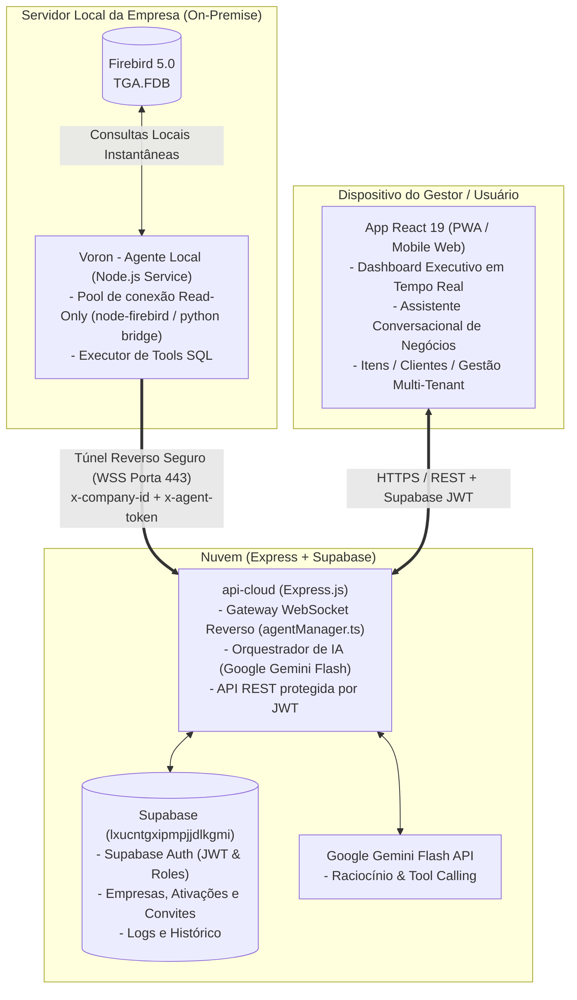

# Arquitetura do Sistema AI DB (Voron)

> **Documento Vivo de Arquitetura (Living Architecture)**  
> **Propósito:** Fonte primária de verdade estrutural para desenvolvedores e agentes de IA. Consulte antes de alterar código ou introduzir novas dependências.

---

## 1. Visão Geral e Topologia

O **AI DB (Voron)** é uma plataforma híbrida móvel e inteligente voltada para gestão e acompanhamento executivo de empresas que utilizam o ERP local baseado em **Firebird 5.0 (`TGA.FDB`)**.

O sistema opera sem exigir abertura de portas em roteadores, IP fixo ou migração massiva de dados para a nuvem, utilizando uma **arquitetura de WebSocket Reverso**.



---

## 2. Estrutura do Repositório (Monorepo npm)

O projeto é gerenciado via `npm workspaces` na raiz (`package.json`):

```
AI DB/
├── shared/          # Contratos TypeScript comuns, DTOs e tipos de comunicação
├── agent/           # Serviço local on-premise conectado ao Firebird
├── backend/         # API Express.js em nuvem, orquestrador Gemini e Gateway WSS
├── mobile/          # PWA / SPA React 19 + Tailwind CSS + Vite
├── docs/            # Dicionário do banco Firebird, especificações e manuais
├── .agents/         # Regras e contexto para assistentes de IA
├── ARCHITECTURE.md  # Este documento (mapa arquitetural do sistema)
└── STATE.md         # Estado atual de implementação e roadmap de tarefas
```

### Detalhamento dos Pacotes:

### 2.1. `@ai-db/shared` (`shared/`)
- **Papel:** *Single Source of Truth* para tipos TypeScript e DTOs de mensagens.
- **Principais Contratos:**
  - `ToolName`: Lista exata de ferramentas executáveis pelo agente local (`consultar_resumo_vendas`, `consultar_ranking_produtos`, `consultar_itens`, etc.).
  - `QueryRequestEnvelope` / `QueryResponseEnvelope`: Envelopes padronizados de ida e volta pelo túnel WebSocket.
  - `ItemProdutoDTO`, `DashboardResumoDTO`, etc.
- **Regra:** **Nunca** duplique tipos no `backend` ou `mobile`. Se um modelo é compartilhado, declare em `shared/types.ts`.

### 2.2. `@ai-db/agent` (`agent/`)
- **Papel:** Executável leve instalado na máquina local/servidor onde o Firebird roda.
- **Mecanismos:**
  - `tunnel.ts`: Mantém o WebSocket reverso conectado ao backend em nuvem com reconexão automática e heartbeat a cada 30 segundos.
  - `executor.ts`: Recebe as chamadas de ferramentas (`toolName`), monta a query parametrizada e consulta o banco local com isolamento `READ ONLY`.
  - Fallback/Bridge: `db-bridge.py` para compatibilidade com versões ou drivers específicos do Firebird.

### 2.3. `@ai-db/backend` (`backend/`)
- **Papel:** Servidor em nuvem intermediário e orquestrador.
- **Mecanismos:**
  - `gateway/agentManager.ts`: Mantém o registro em memória de conexões de agentes (`Map<company_id, WebSocketClient>`).
  - `ai/copilot.ts`: Integra com o Google Gemini Flash via Function Calling; converte perguntas do usuário em chamadas de ferramentas despachadas ao agente local.
  - `middleware/authMiddleware.ts`: Valida os tokens JWT emitidos pelo Supabase Auth e extrai a empresa associada ao perfil do usuário.
  - `services/companyService.ts`: Regras de onboarding de empresas, códigos de ativação (`activation_code`), convites e RBAC.

### 2.4. `@ai-db/mobile` (`mobile/`)
- **Papel:** Interface mobile-first (PWA) de alta performance para o usuário final e administradores.
- **Padrões de UI/UX:**
  - **Apple Human Interface Guidelines (HIG) & Google Material Design 3 (M3)**.
  - Alvos de toque ergonômicos obrigatórios de $\ge 44\text{px}$ / $48\text{px}$.
  - Superfícies translúcidas com efeito *frosted glass* (`backdrop-blur-xl`).
  - Feedback tátil (`navigator.vibrate`) e elástico (`active:scale-[0.98]`).
  - Sem poluição visual ("anti box-in-a-box").

---

## 3. Fluxo de Execução de Consultas (Step-by-Step)

1. **Usuário faz uma requisição** (ex: Abre o Dashboard ou pergunta ao Copilot: *"Quais produtos mais venderam hoje?"*).
2. **App Móvel** dispara chamada para o backend com o Header `Authorization: Bearer <supabase_jwt>`.
3. **Backend (`backend`)**:
   - Valida o token via Supabase Auth e identifica `company_id`.
   - Se for o Copilot, a IA decide invocar `consultar_ranking_produtos`.
   - Gera um `correlationId` único e envelopa a requisição em um `QueryRequestEnvelope`.
   - Despacha via WebSocket para o agente local ativo correspondente em `agentManager`.
4. **Agente Local (`agent`)**:
   - Recebe o envelope pelo túnel seguro.
   - Executa a consulta SQL no Firebird local com transação somente-leitura e limite de tempo.
   - Retorna o `QueryResponseEnvelope` com os dados ou erro pelo mesmo túnel.
5. **Backend** recebe os dados, processa a resposta da IA (ou formata o JSON do dashboard) e responde ao app.

---

## 4. Regras Inegociáveis do Projeto

1. **Isolamento de Banco do Supabase:**
   - O projeto oficial é **exclusivamente** `lxucntgxipmpjjdlkgmi`. É estritamente proibido apontar consultas ou migrações para outros refs.
2. **Proteção do Banco On-Premise (Firebird):**
   - Transações do agente são estritamente `READ ONLY` por padrão. Nenhuma operação de escrita pode ser executada sem fluxo explícito e validado.
3. **Tipagem Centralizada:**
   - Qualquer DTO trafegado entre os serviços deve residir em [`shared/types.ts`](file:///c:/Users/Felipe/Desktop/Programação/AI%20DB/shared/types.ts).
4. **Respeito ao Design System:**
   - Elementos interativos no app mobile devem respeitar a área de toque mínima de $44\times44\text{px}$. Não quebrar a harmonia da `BottomNav` nem aninhar bordas cinzas redundantes.
5. **Autonomia Git Zero:**
   - Nenhum comando de alteração ou inspeção git deve ser executado de forma proativa pela IA sem ordem explícita do usuário.
