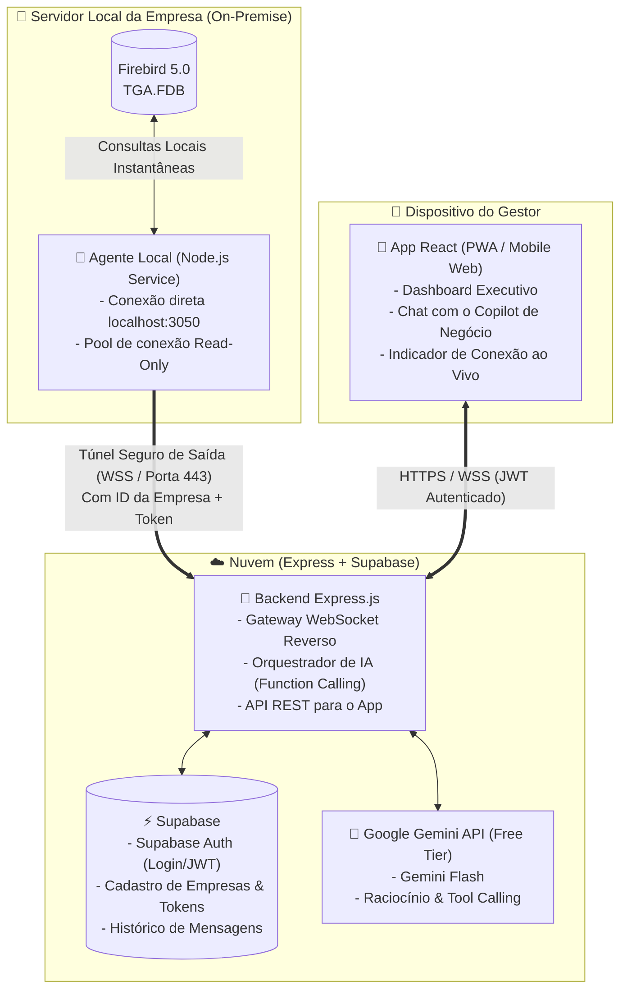

# Especificação de Design: Mobile ERP Copilot & Dashboard

- **Data:** 2026-09-29
- **Status:** Aprovado para Planejamento
- **Autor:** Felipe & Antigravity

---

## 1. Visão Geral e Objetivo do Produto

Criar uma solução móvel (Mobile-first PWA em React) para permitir que gestores e donos de empresas consultem informações estratégicas de seus negócios remotamente pelo celular, a partir de um sistema ERP local cujo banco de dados é **Firebird 5.0**.

A solução opera com:
1. **Dashboard Executivo:** Indicadores em tempo real (Faturamento, Vendas, Contas a Pagar/Receber, Ticket Médio e Top Produtos) sem consumo de tokens de IA.
2. **Copilot de Negócio (IA Conversacional):** Assistente inteligente alimentado pela cota gratuita da **API do Google Gemini** (Gemini Flash), permitindo que o gestor faça perguntas em linguagem natural e receba respostas sintetizadas com dados concretos e mini-tabelas.
3. **Arquitetura Multi-Tenant com WebSocket Reverso:** Conexão direta e segura com o servidor local da empresa através de um túnel de saída seguro (WSS), eliminando a necessidade de abertura de portas no roteador, IP fixo ou replicação pesada de tabelas no Supabase. O projeto inicia com 1 empresa piloto e é estruturado para suportar múltiplas empresas.

---

## 2. Topologia de Rede e Arquitetura



---

## 3. Especificação dos Componentes

### 3.1. Agente Local (`erp-agent`)
* **Ambiente:** Serviço em segundo plano no Windows (Node.js).
* **Conexão com Firebird:** Conexão em `localhost:3050` apontando para o arquivo `TGA.FDB` utilizando biblioteca nativa (`node-firebird`).
* **Parâmetros de Conexão e Isolamento:**
  * Transações estritamente somente-leitura: `READ COMMITTED + RECORD_VERSION + READ ONLY + WAIT (ou NOWAIT)`.
  * Timeout máximo de 4.000 ms por consulta.
* **Comunicação com a Nuvem:**
  * Conexão de saída (outbound) persistente `wss://api.suadominio.com/agent-tunnel`.
  * Cabeçalhos de autenticação: `x-company-id` e `x-agent-token`.
  * Heartbeat / Ping-Pong a cada 30 segundos.
  * Reconexão automática com backoff exponencial (5s, 10s, 30s, 60s).

### 3.2. Backend em Nuvem (`api-cloud` - Express.js)
* **Gerenciador de Conexões WebSocket:**
  * Mantém em memória o mapa de agentes ativos: `Map<company_id, WebSocketClient>`.
  * Rastreia status online/offline de cada cliente e latência de ping.
* **Autenticação e Multi-Tenancy:**
  * Valida tokens JWT emitidos pelo Supabase Auth.
  * Associa cada usuário à sua respectiva `company_id`.
* **Endpoints Principais:**
  * `GET /api/dashboard/overview`: Dispara queries predefinidas ao agente via WebSocket e devolve os números consolidados sem invocar a IA.
  * `POST /api/chat/message`: Recebe a mensagem do usuário, chama a API do Gemini com o esquema de ferramentas (Function Calling), resolve as chamadas de ferramenta no agente local via WebSocket e sintetiza a resposta final.
  * `GET /api/connection/status`: Retorna se o servidor local da empresa está online e o último batimento recebido.

### 3.3. Banco de Dados na Nuvem (Supabase)
Mantido propositalmente enxuto, sem espelhar dados de negócio:
* **Tabelas:**
  * `companies`: `id (UUID)`, `name (VARCHAR)`, `agent_token_hash (VARCHAR)`, `created_at`.
  * `users_companies`: `user_id (UUID - Supabase Auth)`, `company_id (UUID)`, `role (VARCHAR)`.
  * `chat_messages`: `id (UUID)`, `user_id (UUID)`, `company_id (UUID)`, `role ('user' | 'assistant')`, `content (TEXT)`, `metadata (JSONB)`, `created_at`.

### 3.4. Orquestração de IA (Google Gemini Flash - Free Tier)
* **Modelo:** `gemini-1.5-flash` ou `gemini-2.0-flash`.
* **Economia de Cota:** O Dashboard não consome tokens; apenas perguntas ativas no Chat consomem requisições.
* **Ferramentas Parametrizadas (Function Calling):**
  1. `consultar_resumo_vendas(data_inicio, data_fim)`: Total faturado, quantidade de vendas, ticket médio.
  2. `consultar_ranking_produtos(data_inicio, data_fim, limite, ordenacao)`: Produtos mais vendidos ou maior faturamento.
  3. `consultar_fluxo_financeiro(data_referencia, tipo)`: Contas a receber/pagar, vencidos, recebidos no dia.
  4. `consultar_posicao_estoque(termo_busca, apenas_abaixo_minimo)`: Saldo em estoque e custo/preço.
  5. `consultar_historico_cliente(nome_ou_documento)`: Vendas recentes, títulos em aberto e limite de crédito.
  6. `executar_consulta_leitura_segura(sql_select)`: Válvula de escape para perguntas incomuns, com validação estrita de Regex para comandos de alteração (`INSERT`, `UPDATE`, `DELETE`, `DROP` bloqueados) e cláusula forçada `ROWS 1 TO 50`.

---

## 4. Design da Interface Mobile (UI/UX - Apple HIG & Material Design 3)

* **Diretrizes Ergonômicas:**
  * Alvos de toque mínimos de **48×48px** para botões, ícones, seletores e chips.
  * Inputs com padding proporcional (`pr-12`) para evitar sobreposição de botões de envio/limpeza com o texto digitado.
  * Acabamento *Frosted Glass* translúcido (`bg-white/85 backdrop-blur-xl border-slate-200/70`) na Bottom Tab Bar e cabeçalhos.
  * Cores tonais (M3) para status e alertas (`bg-emerald-50 text-emerald-800`, `bg-rose-50 text-rose-800`), reservando cores sólidas para CTAs.
  * Feedback físico tátil (`active:scale-95`) em elementos interativos móveis.
* **Telas do App:**
  1. **Dashboard Executivo:**
     * Badge de status ao vivo no topo (🟢 *Servidor Loja Online* / 🔴 *Servidor Local Indisponível*).
     * Card Hero: Faturamento Hoje (tipografia sem cortes, comparativo percentual).
     * Grid 2×2: Vendas do Dia, Ticket Médio, Contas a Receber, Contas a Pagar.
     * Lista de Top 3 Produtos do Dia.
     * Pull-to-refresh para recarga instantânea.
  2. **Copilot IA (Chat):**
     * Barra de sugestões rápidas de toque (chips horizontais).
     * Histórico de mensagens com suporte a mini-tabelas e valores formatados em moeda (BRL).
     * Entrada de texto ergonômica com botão de envio elástico.
  3. **Configurações & Conexão:**
     * Detalhes da empresa, tempo de resposta do servidor local e encerramento de sessão.

---

## 5. Protocolo de Mensagens do Túnel WebSocket

Envelopes JSON trafegados pelo túnel com chave de correlação:

```typescript
// Envio do Express -> Agente Local
interface QueryRequestEnvelope {
  correlationId: string;
  type: 'QUERY_REQUEST';
  toolName: string;
  params: Record<string, any>;
  timeoutMs: number;
}

// Resposta do Agente Local -> Express
interface QueryResponseEnvelope {
  correlationId: string;
  type: 'QUERY_RESPONSE';
  success: boolean;
  executionTimeMs: number;
  data?: any[];
  error?: string;
}
```

---

## 6. Tratamento de Erros e Contingências

| Cenário de Erro | Comportamento do Sistema |
| :--- | :--- |
| **Servidor Local Desligado / Sem Internet** | Heartbeat expira (>45s). App mobile exibe badge vermelha e bloqueia queries com mensagem clara solicitando verificar o servidor físico da loja. |
| **Query Lenta no Firebird (>4s)** | Agente cancela a transação local com rollback imediato e responde à nuvem com mensagem de timeout controlado para preservar o PDV. |
| **Limite de Cota do Gemini (HTTP 429)** | Express captura o código 429 e retorna aviso amigável para aguardar 30s. Dashboard segue funcionando normalmente. |
| **Sintaxe Firebird em Query Ad-hoc** | Agente reporta o erro e o backend devolve ao Gemini para uma tentativa automática de autocorreção antes de responder erro ao usuário. |

---

## 7. Estratégia de Testes e Validação

1. **Teste Unitário/Integração do Agente com Firebird:**
   * Validar conexão local com `TGA.FDB`.
   * Testar queries das ferramentas padrão medindo tempo de resposta (<100ms esperado).
2. **Teste de Resiliência do Túnel WebSocket:**
   * Simular desconexão e reconexão forçada com backoff exponencial.
   * Testar cancelamento de requisição por timeout.
3. **Teste de Function Calling do Gemini:**
   * Enviar perguntas coloquiais em português e validar extração correta de datas e filtros.
4. **Teste de Usabilidade Mobile:**
   * Testar viewport móvel em dispositivos iOS e Android, auditando alvos de toque e ausência de truncamento acidental de textos.
